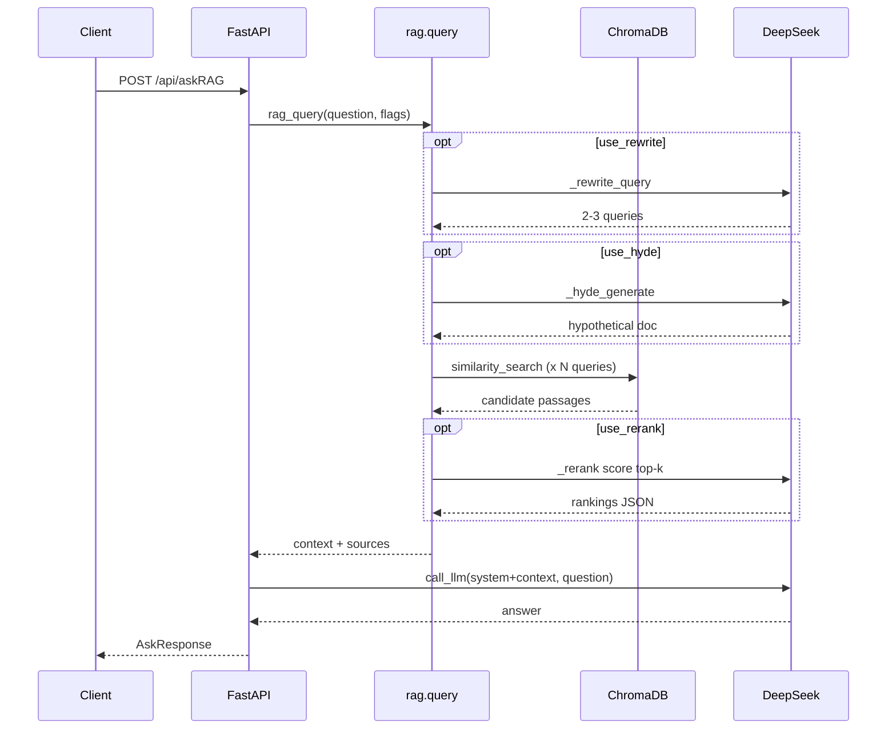
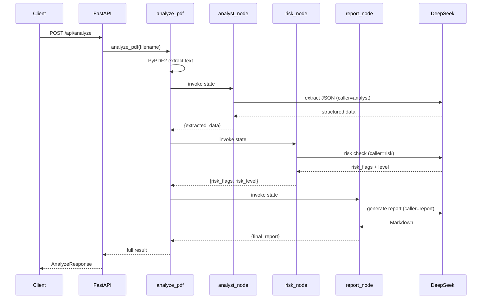

# 两条核心链路深挖

---

## 链路一：`POST /api/askRAG` 全链路

### 请求入口

**文件**：`app/main.py` → `ask_rag()`

```python
AskRequest:
  question: str
  use_rag: bool = True
  use_rerank: bool = True
  use_rewrite: bool = False
  use_hyde: bool = False
  model: str = "deepseek-v4-flash"
```

### 步骤拆解

```
1. get_llm(model)           # config.py，校验模型名，返回缓存的 ChatOpenAI
2. rag_query(...)           # app/rag.py query()
   2a. _get_vectorstore()   # ChromaDB，不存在则 _rebuild_index()
   2b. fetch_k = k*3 if rerank else k   # 默认 k=4 → fetch 12
   2c. 构建 search_queries:
       - 始终含原始 question
       - use_rewrite → _rewrite_query() 追加 2-3 条改写
       - use_hyde → _hyde_generate() 追加假设答案文本
   2d. 检索:
       - 单 query: similarity_search(question, k=fetch_k)
       - 多 query: 每路 per_query_k = max(fetch_k//n, k)，前200字去重合并
   2e. use_rerank → _rerank(question, passages, top_n=k)
       - LLM 对每条打 0-10 分，JSON 解析选 top-k
       - 失败 fallback 取前 k 条
   2f. 拼接 context = "[来源: xxx]\n内容\n\n---\n\n..."
   返回 (context, passages)
3. 构建 system_prompt（含「严格基于参考文档」+ context）
4. call_llm(llm, messages, caller="ask_rag")
5. 返回 AskResponse(answer, sources=passages)
```

### 时序图



### 关键代码锚点

| 步骤 | 文件:行 | 函数 |
|------|---------|------|
| API 入口 | main.py:100 | `ask_rag` |
| 检索主逻辑 | rag.py:208 | `query` |
| Rewrite | rag.py:154 | `_rewrite_query` |
| HyDE | rag.py:194 | `_hyde_generate` |
| Rerank | rag.py:80 | `_rerank` |
| Embedding | rag.py:27 | `DashScopeV4Embeddings` |

### 面试可讲的设计决策

1. **原问题始终参与检索** — Rewrite/HyDE 是增强，不替换原 query
2. **去重用前 200 字符** — 兼顾不同 chunk 边界产生的近似重复
3. **Rerank 失败不阻断** — graceful degradation 到 vector top-k
4. **context 带来源标注** — 方便前端展示 + 约束 LLM 引用

---

## 链路二：`POST /api/analyze` LangGraph 全流程

### 请求入口

**文件**：`app/main.py` → `analyze()` → `graph.analyze_pdf(filename)`

### 步骤拆解

```
1. analyze_pdf(filename)
   1a. 检查 data/{filename} 是否存在
   1b. PdfReader 提取 raw_text（全页 join）
   1c. graph.invoke(initial_state)

2. LangGraph 状态机（线性）:
   START → analyst → risk → report → END

3. analyst_node(state):
   - 输入: state["raw_text"]
   - 截断 8000 字符
   - call_llm(ANALYST_PROMPT + 研报内容)
   - 解析 JSON → partial update {"extracted_data": {...}}

4. risk_node(state):
   - 输入: state["extracted_data"]
   - 若有 error → 直接返回 high risk 占位
   - call_llm(RISK_PROMPT + JSON 数据)
   - 解析 → {"risk_flags": [...], "risk_level": "high/medium/low"}

5. report_node(state):
   - 输入: extracted_data + risk_flags + risk_level
   - call_llm(REPORT_PROMPT + 汇总文本)
   - 输出 Markdown → {"final_report": "..."}

6. 返回 AnalyzeResponse 四字段
```

### State 传递机制

```python
class AnalysisState(TypedDict):
    pdf_filename: str
    raw_text: str
    extracted_data: Optional[dict]
    risk_flags: Optional[list]
    risk_level: Optional[str]
    final_report: Optional[str]
```

- 每个节点返回 `dict` 是 **partial update**，LangGraph 合并进 state
- 不需要返回完整 state
- `graph.invoke()` 阻塞直到 END

### 时序图



### analyst 提取字段（要能背）

```json
{
  "company_name", "stock_code",
  "key_metrics": {"营收", "利润", "增速"},
  "industry_data": {"行业规模", "增长率"},
  "trends": [],
  "investment_advice",
  "data_quality": "high/medium/low"
}
```

### risk 五维检查（要能背）

1. 数据合理性（极端增速/估值偏离）
2. 数据一致性（指标矛盾）
3. 缺失风险（null 关键字段）
4. 行业风险（政策、竞争、技术替代）
5. 集中度风险（单一客户/产品/市场）

### report 输出结构

- 核心数据（表格）
- 风险提示（⚠️ 标记高风险）
- 投资要点（3-5 条）
- 综合评级：推荐关注 / 中性观望 / 谨慎回避

### 与 RAG 链路的关系

| 维度 | askRAG | analyze |
|------|--------|---------|
| 输入 | 自然语言问题 | PDF 文件名 |
| PDF 用法 | 预索引 chunks 检索 | 全文送 LLM |
| LLM 调用次数 | 1-4+（看开关） | 固定 3 次 |
| 输出 | 问答 + sources | 结构化数据 + 风险 + 报告 |
| 适用场景 | 「这份报告里 ROE 怎么说？」 | 「帮我分析整份研报」 |

**当前未打通**：analyze 不经过向量库；未来可让 analyst 先 RAG 检索相关章节再提取。

---

## 链路对比速记卡

```
askRAG:  问题 → [Rewrite/HyDE] → 向量检索 → [Rerank] → LLM 回答
analyze: PDF → 全文 → analyst → risk → report（3×LLM 串行）
```

---

## 模拟白板题

**题**：如果 analyze 太慢，怎么优化？

答：
1. 短期：`asyncio.to_thread(graph.invoke)` + 返回 task_id 轮询
2. 中期：analyst 用 RAG 只送相关 chunk，减少 token
3. 长期：analyst 和 risk 并行（都读 extracted 前的 raw_text 子集），report 等两者完成

**题**：askRAG 幻觉怎么防？

答：system prompt 约束 + 检索 context 带源 + sources 返回给前端核对；未覆盖 generation eval 和 citation 强制格式。
